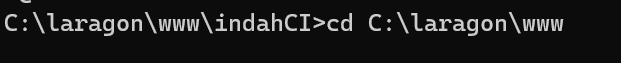

# TUGAS1-PBF Indah Kurniawati S-220102085

## Apa itu CodeIgniter?
CodeIgniter adalah salah satu FreamWork yang ada di PHP yang bersifat Open Source yang menggunakan Metode MVC (Model,Viwe,Controler). Framwork (softwear freamwork) adalah sudatu kerangka kerja yang berisi aturan” sesuai dengan bahasanya, dan ada fungsi” yang reuseability atau di gunakan berulang”
#### **Mengapa Perlu Menggunakan CodeIgniter**
1.	Small footprint = Ci adalah  freamwork yang ukuran nya kecil 
2.	Perfomance yang baik
3.	Hampir ”zero configuration” = hanya dengan menginstall saja sudah siap di gunakan tidak banyak melakukan konfigurasi
4.	Tidak harus menggunakan command line
5.	Tidak harus mengikuti aturan coding yang ketat 
6.	Tidak harus menggunakan tempalte engine
7.	Dokumentasi yang jelas
8.	Menggunakan mvc
## Installation
#### Syarat Menginstall CodeIgniter
Diperlukan PHP minimal versi 7.4 atau lebih baru.
#### **Installation Composer**
1. Buka folder root yang akan digunakan untuk menyimpan Folder CodeIgniter, klik kanan lalu buka folder tersebut lewat Terminal. 
   Ketikkan :
   
```shell
$ composer create-project codeigniter4/appstarter nama-project
```
2. Jalankan server
```shell
$ cd nama-root
$ php spark serve
```
